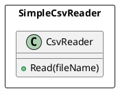
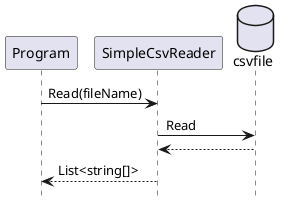

# SimpleCsvReader 

## Introduction
SimpleCsvReader provide only CsvReader class.

```plantuml
@startuml
skinparam shadowing false
package SimpleCsvReader <<rectangle>>{
    class CsvReader {
        + Read(fileName)
    }
}
@enduml
```


## Usage
### Load a CSV file
```csharp
            List<string[]> rows = CsvReader.Read(fileName);
```


```plantuml
@startuml
skinparam shadowing false
hide footbox
participant Program as User
participant SimpleCsvReader
database csvfile
User -> SimpleCsvReader : Read(fileName)
SimpleCsvReader -> csvfile : Read
SimpleCsvReader <-- csvfile
User <-- SimpleCsvReader : List<string[]>
@enduml
```
