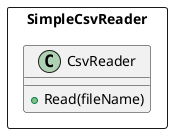
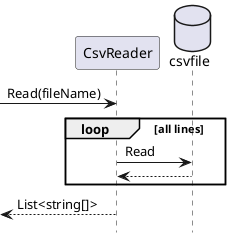

# SimpleCsvReader 

"SimpleCsvReader" is a .NET library that reads a CSV file.

## Introduction
SimpleCsvReader provide only CsvReader class.



## Usage
### Read a CSV file
```csharp
            List<string[]> rows = CsvReader.Read(fileName);
```


