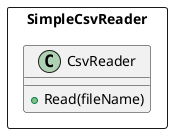
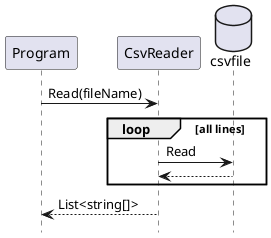

# SimpleCsvReader 

## Introduction
SimpleCsvReader provide only CsvReader class.



## Usage
### How to read a CSV file
```csharp
            List<string[]> rows = CsvReader.Read(fileName);
```


